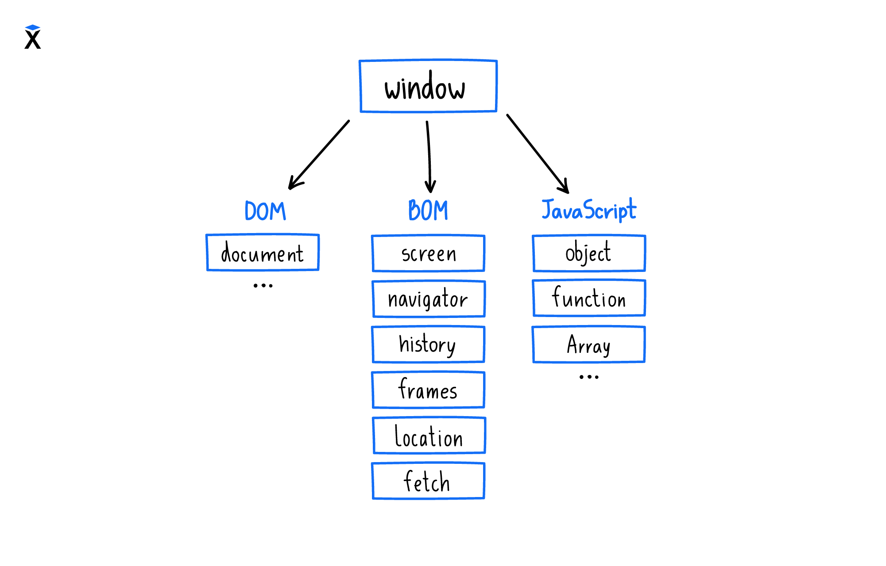
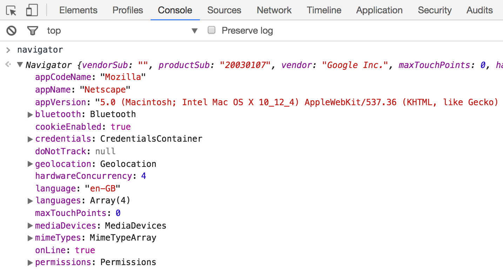
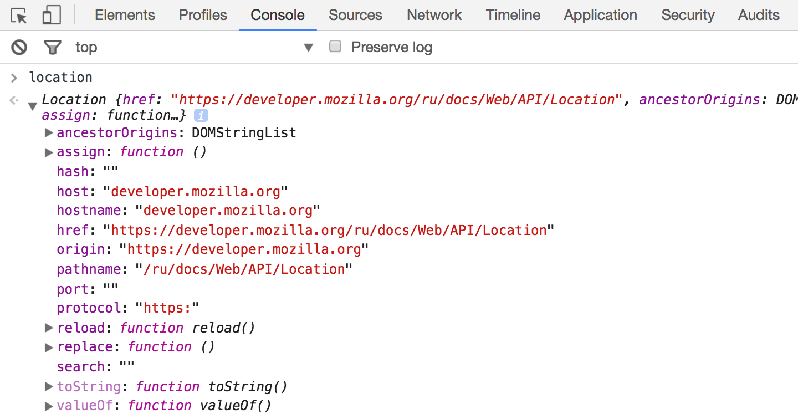
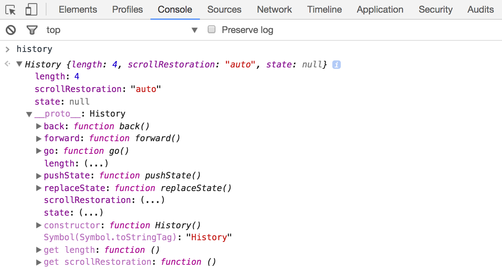
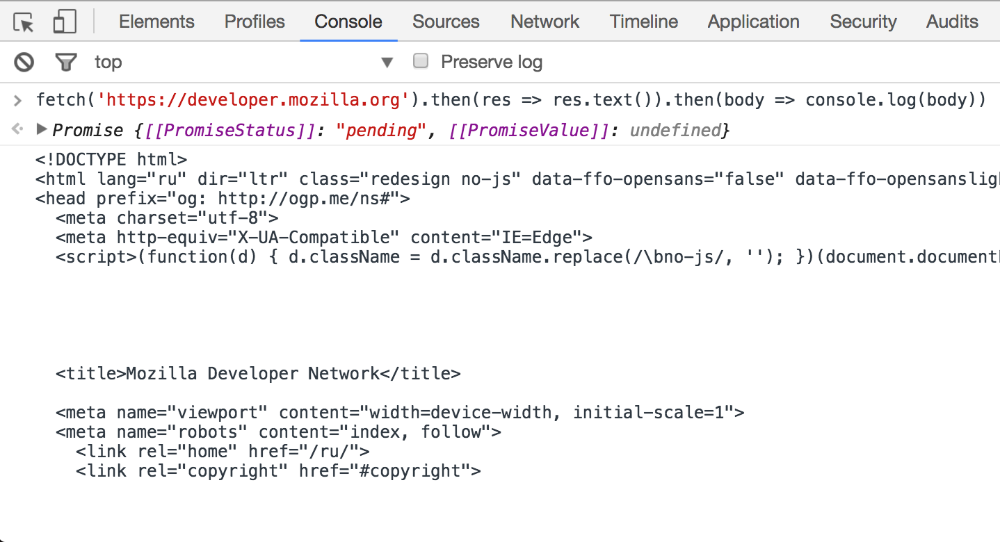
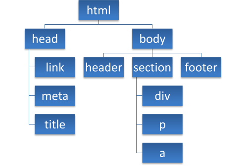

>[!TIP]
>Что такое BOM?
#### BOM (Browser Object Model) — это набор глобальных объектов, которые управляют поведением браузера. Все они также находятся внутри window. Все объекты, через которые JavaScript взаимодействует с браузером, описываются таким понятием как Browser Object Model (Объектная Модель Браузера).

#### Разберем некоторые из них.

<br>

#### `Navigator` - Он предоставляет информацию о браузере, например, версию, имя, используемую локаль, доступные разрешения и включенные плагины:

<br>

#### `Location` - Он позволяет управлять адресной строкой. Например, так можно инициировать загрузку другой страницы:

>location.href = 'https://hexlet.io';


<br>

#### `History` - С помощью этого объекта можно перемещаться по истории переходов.Более того, его можно формировать в тех случаях, когда не происходит реального перехода по страницам: 

<br>

#### `Fetch` - предоставляет возможность работы с сетью, с его помощью можно отправлять запросы на сервер.

<br>

# Что такое DOM?

#### DOM — это объектная модель документа, которую браузер создает в памяти компьютера на основании HTML-кода, полученного им от сервера. Иными словами, это представление HTML-документа в виде дерева тегов.

### Как строится DOM-дерево

#### Для описания структуры DOM потребуются термины: корневой, родительские и дочерние элементы. Корневой элемент находится в основании всей структуры и не имеет родительского элемента. Дочерние элементы не просто находятся внутри родительских, но и наследуют различные свойства от них. На картинке ниже изображено DOM-дерево.



> Все эти теги не являются уникальными, и в одном документе может быть по несколько экземпляров каждого из них.

#### `querySelector()` является мощным инструментом для поиска элементов на веб-странице по CSS-селекторам. Это метод JavaScript, который позволяет получить первый элемент на веб-странице, соответствующий заданному CSS-селектору. Он используется для того, чтобы получить ссылку на элемент и работать с ним в JavaScript.

```
.querySelector() имеет следующий синтаксис:

document.querySelector(cssSelector);
где:

cssSelector это строка, содержащая CSS-селектор, по которому мы ищем элемент.
Пример использования .querySelector() для получения ссылки на первый элемент с классом myClass:
```

```
<div class="myClass">Это мой элемент 1</div>
<div class="myClass">Это мой элемент 2</div>
<p>Это не мой элемент</p>
```

```
const element = document.querySelector('.myClass');
element.style.color = 'red';
```

#### Свойство `innerHTML` позволяет получить и изменить HTML код элемента.

```
<p id="elem"><b>text</b></p>

let elem = document.querySelector('#elem');

console.log(elem.innerHTML);
```

```
<p id="elem"><b>text</b></p>

let elem = document.querySelector('#elem');

elem.innerHTML = '<i>!!!</i>';
```

```
Результат выполнения кода:

<p id="elem"><i>!!!</i></p>
```

#### Объект Style представляет собой индивидуальное заявление о стиле.

```
let elem = document.querySelector('.a')
elem.style.color= 'red'
```

#### События DOM присылаются чтобы уведомить код о том, что интересующие его действия произошли. События могут возникать в результате действий пользователя, таких как использование мыши или изменение размера окна, изменения состояния базовой среды (например, низкий заряд батареи или мультимедийные события из операционной системы) и других причин.


#### JavaScript предоставляет ряд методов для управления элементами на веб-страницы. В частности, мы можем создавать и добавлять новые элементы или заменять и удалять уже имеющиеся. Рассмотрим эти методы.

##### Для создания элементов объект document имеет следующие методы:
* createElement(elementName): создает элемент html, тег которого передается в качестве параметра. Возвращает созданный элемент

```
let header = document.createElement('h2');

header.innerHTML = 'hello';
header.style.height='100px'
header.style.color = 'black';

document.body.appendChild(header)
```

#### Однако одного создания элементов недостаточно, их еще надо добавить на веб-страницу.

#### Для добавления элементов мы можем использовать один из методов объекта Node: appendChild(newNode): добавляет новый узел newNode в конец коллекции дочерних узлов

#### `Element.classList` — это доступное только для чтения свойство, которое содержит текущую коллекцию DOMTokenList всех атрибутов class элемента.

#### Использование _classList_ представляет более удобный способ, чем доступ к списку классов элемента в виде строки, разделенной пробелами, через element.className.

#### `DOMTokenList` представляет содержимое атрибута class элемента. Если атрибут class не установлен или пуст, то будет возвращён пустой _DOMTokenList,_ то есть _DOMTokenList_ со свойством _length_ равным _0._

#### Хотя само свойство `classList` доступно только для чтения, можно изменять связанный с ним DOMTokenList с помощью методов _add(),_ _remove(),_ _replace()_ и _toggle()._

#### Для проверки, содержит ли элемент какой-либо класс можно использовать метод `classList.contains().`

```
const div = document.createElement("div");
div.className = "foo";

// Начальное состояние: <div class="foo"></div>
console.log(div.outerHTML);

// Используем classList API для удаления и добавления классов
div.classList.remove("foo");
div.classList.add("anotherclass");

// <div class="anotherclass"></div>
console.log(div.outerHTML);

// Если класс "visible" присутствует в списке классов, то он будет удалён, а иначе наоборот добавлен
div.classList.toggle("visible");

// Добавление/удаление класса "visible" в зависимости от условия, передаваемого вторым аргументом
div.classList.toggle("visible", i < 10);

// false
console.log(div.classList.contains("foo"));

// Добавление или удаление нескольких классов сразу
div.classList.add("foo", "bar", "baz");
div.classList.remove("foo", "bar", "baz");

// Добавление или удаление нескольких классов с использованием spread-синтаксиса
const cls = ["foo", "bar"];
div.classList.add(...cls);
div.classList.remove(...cls);

// Замена класса "foo" классом "bar"
div.classList.replace("foo", "bar");

```